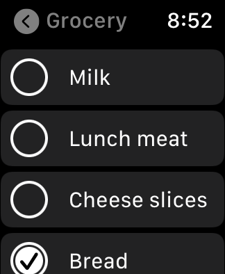
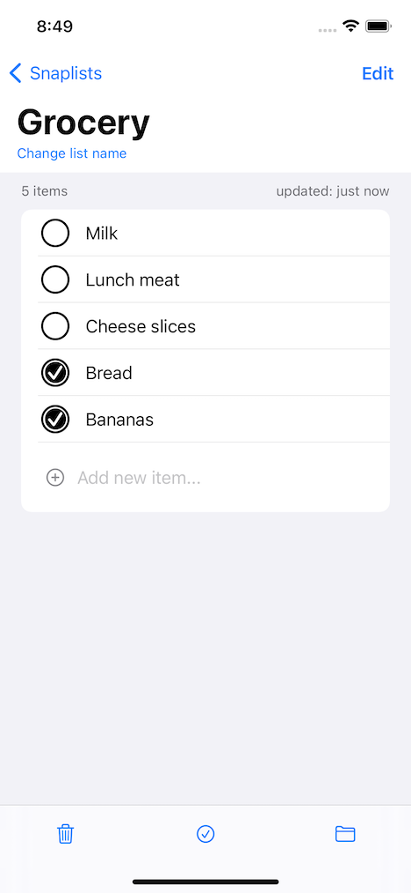
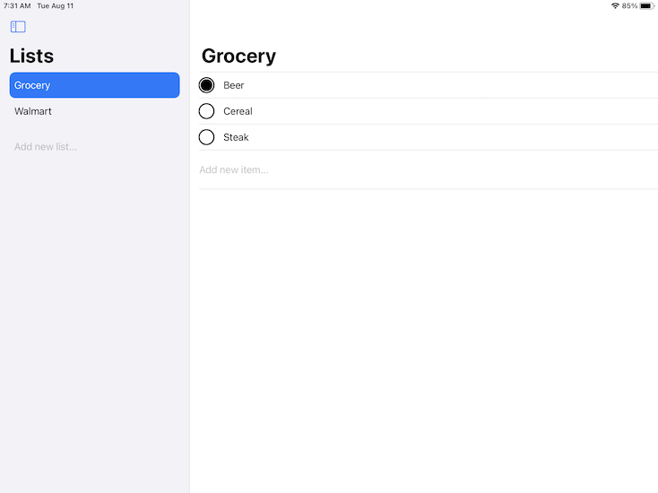
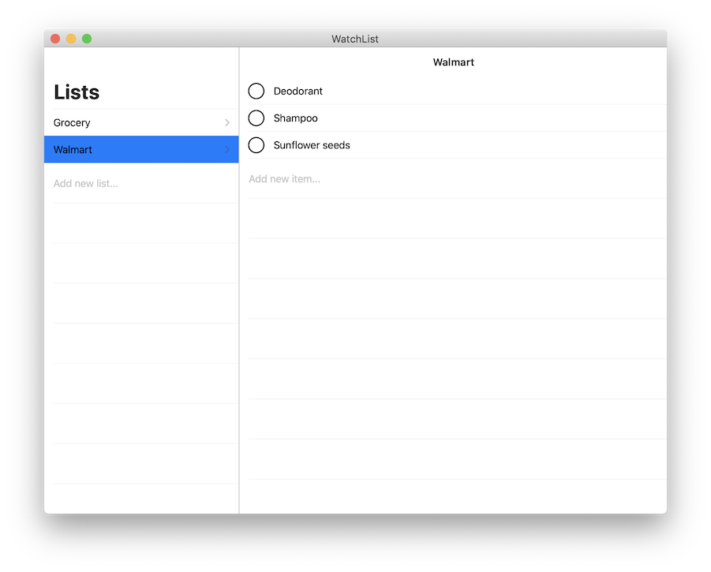

# WatchList
A simple shopping list app for iOS &amp; watchOS. Its goal is an easy-to-use list app for the Apple Watch.

The app uses Core Data locally and CloudKit to sync data across Apple Watch and iOS devices.  The UI is built with SwiftUI.

**Important:** This app was developed with Xcode 12 beta. It will not build successfully with previous versions of Xcode.

Apple Watch:

iPhone:

iPad:

Mac:

