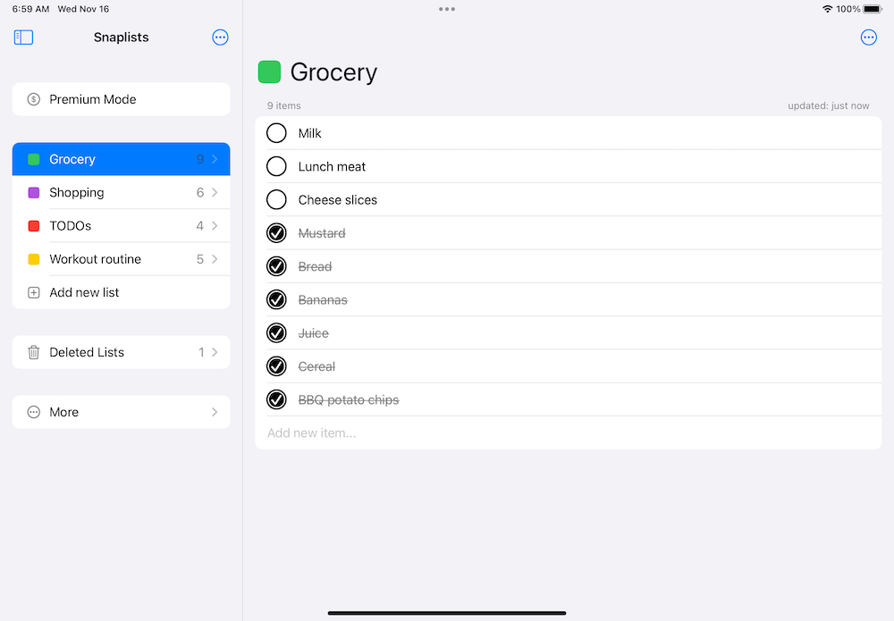

# Snaplists
A simple list-making app for iOS &amp; watchOS. Its goal is an easy-to-use list app for the Apple Watch.

The app uses **Core Data** and **CloudKit** to sync data across Apple Watch and iOS devices.  The UI is built with **SwiftUI**.

_NOTE: I removed this app from the App Store on May 27, 2024. Read about why [here](https://www.sleekible.com/2024/05/27/app-store-retirement.html)._

Apple Watch:

iPhone:

iPad:

